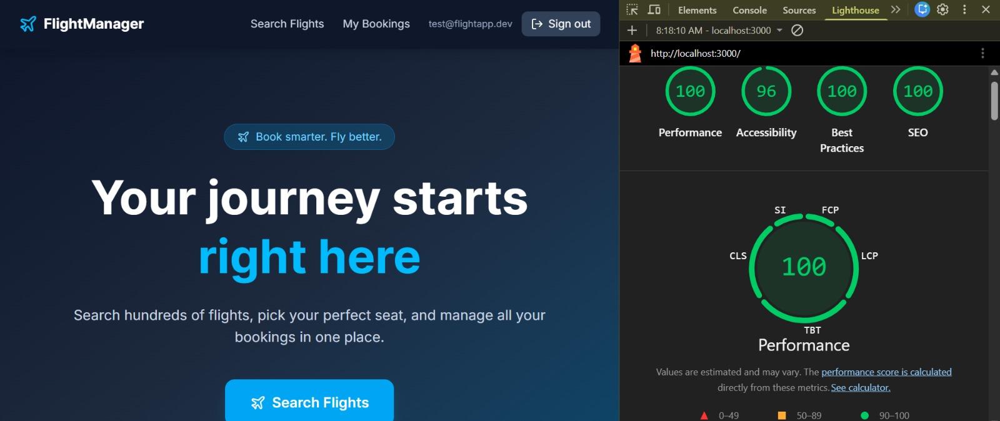

# FlySphere

A full-stack flight booking web app built with Next.js 14, Supabase, and Zustand. Passengers can search flights, pick seats on a live seat map, book tickets, and manage their bookings.

**Live Demo:** [https://fly-sphere-sage.vercel.app](https://fly-sphere-sage.vercel.app)  
**Test Account:** `test@flightapp.dev` / `TestPass123!`

---

## Lighthouse Scores



Performance: **100** · Accessibility: **96** · Best Practices: **100** · SEO: **100**

---

## Tech Stack

- **Frontend & API:** Next.js 14 (App Router, Server Components)
- **Database & Auth:** Supabase (PostgreSQL + Auth + Realtime)
- **State Management:** Zustand with persist middleware
- **Styling:** Tailwind CSS
- **PWA:** next-pwa (bonus)

---

## Features

- Flight search by origin, destination, date, passenger count, and class
- Interactive seat map with First / Business / Economy zones
- Live seat availability via Supabase Realtime — no page refresh needed
- Atomic seat reservation using a Supabase RPC function (prevents double-booking)
- Passenger details form with PNR confirmation
- My Bookings page with reschedule and cancel flows
- Reschedule fee charged when new flight is more expensive
- Cancellations blocked within 2 hours of departure (enforced at DB level)
- Bookings blocked within 1 hour of departure
- Responsive on mobile, tablet, and desktop
- PWA — installable on mobile with manifest, icons, and offline fallback page

---

## Local Setup

```bash
# 1. Clone the repo
git clone https://github.com/Arnab-Mandal1/FlySphere.git
cd FlySphere

# 2. Install dependencies
npm install

# 3. Create environment file
cp .env.example .env.local
# Fill in your Supabase URL and keys in .env.local

# 4. Start the dev server
npm run dev
```

Open [http://localhost:3000](http://localhost:3000)

---

## Supabase Setup

1. Create a new project at [supabase.com](https://supabase.com)
2. Go to **SQL Editor** and run these files in order:
   - `supabase/migrations/001_create_tables.sql`
   - `supabase/migrations/002_rls_policies.sql`
   - `supabase/migrations/003_rpc_functions.sql`
   - `supabase/migrations/004_booking_cutoff.sql`
3. Run `supabase/seed/seed.sql` to populate flights and seats
4. Go to **Authentication → Users** and create: `test@flightapp.dev` / `TestPass123!`
5. Go to **Settings → API** and copy your URL and keys into `.env.local`

---

## Environment Variables

```
NEXT_PUBLIC_SUPABASE_URL=your_project_url
NEXT_PUBLIC_SUPABASE_ANON_KEY=your_anon_key
SUPABASE_SERVICE_ROLE_KEY=your_service_role_key
NEXT_PUBLIC_APP_URL=https://fly-sphere-sage.vercel.app
```

---

## Database Schema

- **flights** — flight number, origin, destination, departure/arrival times, aircraft type, status, base price
- **seats** — linked to a flight, seat number, class (economy/business/first), availability, extra fee
- **bookings** — links user, flight, and seat; stores PNR code, total price, and status
- **passengers** — passenger details per booking (name, passport, nationality, DOB)
- **reschedules** — records every reschedule with old/new flight and fee charged

Row Level Security is enabled on all tables. Users can only access their own bookings, passengers, and reschedules. Flights and seats are publicly readable for search.

---

## Zustand Store Architecture

Two stores handle all client state:

**`useFlightStore`** — manages the active booking journey:
- `searchQuery` — current search parameters (origin, dest, date, class, passengers)
- `selectedFlight` — the flight the user picked from results
- `selectedSeat` — the seat selected on the map
- `currentStep` — tracks where in the flow the user is (search → results → seat → passenger → confirm)
- `passengerForm` — form data for the passenger details step
- `optimisticSeatId` — seat marked as selected before the server confirms

`partialize` is used to exclude `passport_no` from localStorage — sensitive data never touches the browser's persistent storage.

**`useUserStore`** — manages auth and cached bookings:
- `sessionToken` — persisted for session continuity
- `cachedBookings` — stored locally so My Bookings is readable offline
- `user` — NOT persisted (re-hydrated from Supabase on mount)

Both stores have a `resetAll` / `resetUser` action triggered on logout and booking cancellation.

---

## Key Decisions & Trade-offs

**Atomic seat locking:** The `reserve_seat` RPC uses `FOR UPDATE` row locking in PostgreSQL to prevent two users booking the same seat simultaneously. Runs as `SECURITY DEFINER` so only the function can mark seats unavailable — not client-side code.

**2-hour cancellation rule:** Enforced both in the `cancel_booking` RPC and as a database trigger on the bookings table. Even if someone bypasses the API, the DB will reject the update.

**1-hour booking cutoff:** Enforced client-side on the results page (blocks navigation) and server-side via a DB trigger on booking insert.

**Server Components for data fetching:** Flight search results and seat maps are fetched in Server Components using the server-side Supabase client. The anon key is never exposed beyond what Next.js makes available to the browser.

**Zustand over Context:** Zustand's `persist` middleware with `partialize` gave fine-grained control over what gets stored in localStorage, which was important for excluding passport numbers.

**PWA trade-off:** manifest.json, service worker, and offline fallback page are fully configured. The app is installable on mobile. Full offline caching has a compatibility issue between next-pwa v5 and Next.js 16's webpack mode that I was unable to resolve before the deadline.

**Incomplete features:**
- Multi-passenger booking — the schema supports it via the passengers table but the UI only handles one passenger per booking
- Email notifications on booking confirmation

---

## Seed Data

Routes available for testing:

| Route | Flights | Base Price |
|-------|---------|------------|
| DEL → BOM | FM101, FM102 | ₹4,500 – ₹5,200 |
| BOM → BLR | FM201, FM202 | ₹3,800 – ₹4,100 |
| BLR → HYD | FM301, FM302 | ₹2,900 – ₹3,200 |
| HYD → DEL | FM401, FM402 | ₹5,500 – ₹6,800 |

Each flight has 128 seats: 4 First class (rows 1-2), 8 Business (rows 3-6), 116 Economy (rows 7-26).
